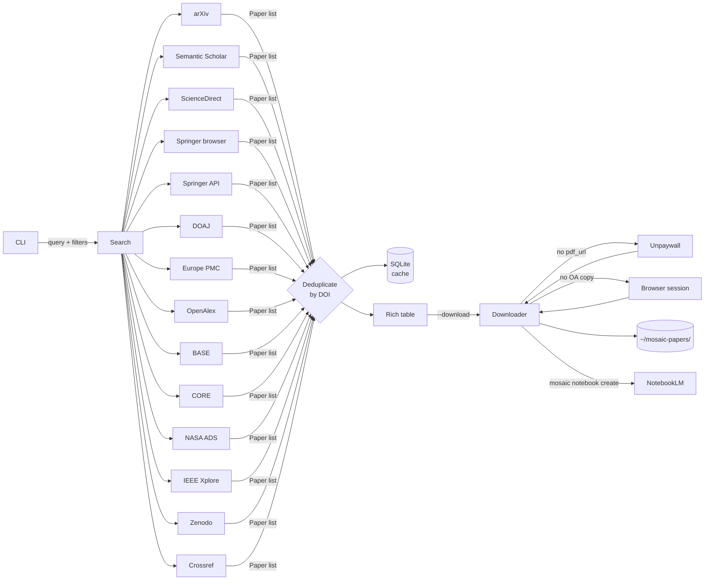

<div align="center">

<picture>
  <source media="(prefers-color-scheme: dark)"  srcset="docs/public/mosaic-logo-alpha-white.png">
  <source media="(prefers-color-scheme: light)" srcset="docs/public/mosaic-logo-alpha-black.png">
  
</picture>

#### *a vivid mosaic of open scientific literature, assembled in seconds*

### Multi-sOurce Scientific Article Indexer and Collector

>Search, discover, and download scientific papers from multiple open databases — with a single command.
>Send results directly to [Google NotebookLM](https://notebooklm.google.com/) for AI-powered summaries, podcasts, and more.

[](https://github.com/szaghi/mosaic/releases/latest)
[](https://github.com/szaghi/mosaic/actions/workflows/tests.yml)
[](https://szaghi.github.io/mosaic/)
[](https://www.python.org/)
[](LICENSE.gpl3.md)
[](LICENSE.bsd-2.md)
[](LICENSE.bsd-3.md)
[](LICENSE.mit.md)

**[Full documentation](https://szaghi.github.io/mosaic/)**

</div>

---

## What is MOSAIC?

Instead of visiting a dozen or more different websites to hunt for a paper, MOSAIC queries them all simultaneously, deduplicates results by DOI, and downloads open-access PDFs — including those found via [Unpaywall](https://unpaywall.org/) — in one shot. Results can also be sent directly to a [Google NotebookLM](https://notebooklm.google.com/) notebook for AI-powered Q&A, audio overviews, video summaries, slide decks, mind maps, flashcards, quizzes, infographics, study guides, and more.

```bash
mosaic search "attention is all you need" --oa-only --download
mosaic notebook create "Attention Papers" --query "attention is all you need" --oa-only --podcast
```

## Why MOSAIC?

Finding scientific papers across databases is tedious:

- Each database has its own search syntax and web interface
- The same paper often appears in multiple databases under slightly different metadata
- Locating a free legal PDF requires checking the journal site, arXiv, PubMed Central, and institutional repositories
- There is no programmatic way to keep a local archive of your searches
- There is no automatic summary creation for bibliographics collections

MOSAIC solves all of this in a single command.

## Design principles

- **One command, many sources** — fan-out search with transparent deduplication
- **Legal open-access only by default** — no paywall circumvention
- **Closed-access** — supported by users API key (if provided, e.g. Elsevier source)
- **Authenticated access** — save a browser session once with `mosaic auth login`; the downloader reuses it silently on future runs
- **Minimal dependencies** — `httpx`, `typer`, `rich`, `tomli-w`; no heavy frameworks
- **Offline-friendly** — local SQLite cache means repeated queries are instant
- **Extensible** — each source is an independent class; adding a new one takes ~50 lines
- **Custom sources** — wire any number of JSON REST APIs as new sources with a few lines of TOML each, no Python needed
- **AI-powered artifacts creation (summary, presentation, podcast, ecc...)** by [Google NotebookLM](https://notebooklm.google.com/)

---

## Sources

| Source | Shorthand | Coverage | Auth | OA PDF |
|---|---|---|---|---|
| **arXiv** | `arxiv` | Physics, CS, Math, Biology… | None | Always |
| **Semantic Scholar** | `ss` | 214 M papers, all disciplines | Optional key | When indexed |
| **ScienceDirect** | `sd` | Elsevier journals & books | API key or browser session | OA articles |
| **Springer Nature** | `sp` | Springer, Nature & affiliated journals (browser) | None (`[browser]` extra) | Via Unpaywall |
| **Springer Nature API** | `springer` | OA articles from Springer, Nature & affiliated journals | Free API key | Direct PDF link |
| **DOAJ** | `doaj` | 8 M+ fully open-access articles | None | Always |
| **Europe PMC** | `epmc` | 45 M biomedical papers | None | PMC articles |
| **OpenAlex** | `oa` | 250 M+ works, all disciplines | None | When available |
| **BASE** | `base` | 300 M+ docs from 10 000+ repos | None | When OA + PDF format |
| **CORE** | `core` | 200 M+ OA full-text from repos | Free API key | `downloadUrl` field |
| **NASA ADS** | `ads` | 15 M+ astronomy & astrophysics records | Free API token | OA articles |
| **IEEE Xplore** | `ieee` | 5 M+ IEEE journals, transactions & conference proceedings | Free API key | OA articles |
| **Zenodo** | `zenodo` | 3 M+ OA research outputs (papers, datasets, software) | None (token optional) | Attached PDF files |
| **Crossref** | `crossref` | 150 M+ scholarly works (DOI registry) | None (email optional) | When deposited by publisher |
| **Unpaywall** | — | PDF resolver for any DOI | Email only | Legal OA copy |

---

## Installation

```bash
# recommended — isolated install, globally available
pipx install mosaic-search        # or: uv tool install mosaic-search
```

```bash
# pip — must be inside a virtualenv (modern systems enforce PEP 668)
python -m venv ~/.venvs/mosaic && source ~/.venvs/mosaic/bin/activate
pip install mosaic-search
```

```bash
# from source
git clone https://github.com/szaghi/mosaic
cd mosaic
python -m venv .venv && source .venv/bin/activate
pip install -e .
```

> Requires Python 3.11+

---

## Quick Start

```bash
# 1. Set your email (enables Unpaywall PDF fallback)
mosaic config --unpaywall-email you@example.com

# 2. Optional: add an Elsevier API key to unlock ScienceDirect
mosaic config --elsevier-key YOUR_KEY

# 3. Search and download
mosaic search "transformer architecture" --oa-only --download
```

---

## Usage

### Search

```bash
# Search all enabled sources (10 results per source by default)
mosaic search "protein folding"

# More results, open-access only
mosaic search "deep learning" -n 25 --oa-only

# Single source
mosaic search "RNA velocity" --source epmc
```

**Source shorthands:** `arxiv` · `ss` · `sd` · `doaj` · `epmc` · `oa` · `base` · `core`

Custom sources defined in `config.toml` are also queried and addressable by their `name`.

### Filters

```bash
# By year — single, range, or list
mosaic search "BERT" --year 2019
mosaic search "diffusion models" -y 2020-2023
mosaic search "GPT" -y 2020,2022,2024

# By author (repeatable, OR logic, case-insensitive substring)
mosaic search "attention" -a Vaswani -a Shazeer

# By journal (case-insensitive substring)
mosaic search "CRISPR" --journal "Nature"

# Combine freely
mosaic search "graph neural" -y 2021-2023 -a Kipf -j "ICLR" --oa-only --download
```

### Download by DOI

```bash
mosaic get 10.48550/arXiv.1706.03762
```

Checks the local cache first, then tries Unpaywall if no PDF URL is known.

### Configuration

```bash
mosaic config --show                          # print current config
mosaic config --unpaywall-email me@uni.edu
mosaic config --elsevier-key abc123
mosaic config --ss-key xyz789
mosaic config --download-dir ~/papers
```

Config is stored at `~/.config/mosaic/config.toml`. Downloaded PDFs go to `~/mosaic-papers/` by default.

### Custom sources

Any number of JSON REST APIs can be added as new sources directly in `config.toml` — one `[[custom_sources]]` block per source, no Python required:

```toml
[[custom_sources]]
name         = "My Institution Repo"
enabled      = true
url          = "https://repo.myuni.edu/api/search"
method       = "GET"
query_param  = "q"
results_path = "results"

[custom_sources.fields]
title    = "title"
doi      = "doi"
year     = "year"
authors  = "authors"    # flat string array
journal  = "source.title"
```

See the [Custom Sources guide](https://szaghi.github.io/mosaic/guide/custom-sources) for the full reference.

### NotebookLM

Send search results directly to a Google NotebookLM notebook:

```bash
# 1. Inject into MOSAIC (--include-apps exposes the notebooklm CLI)
pipx inject --include-apps mosaic-search "notebooklm-py[browser]"

# 2. Install Chromium — playwright lives inside the pipx venv, call it directly
~/.local/share/pipx/venvs/mosaic-search/bin/playwright install chromium

# 3. Authenticate once
notebooklm login

# 4. Search, download, and create a notebook in one command
mosaic notebook create "Transformers" --query "transformer architecture" --oa-only --podcast

# Or import PDFs you already have
mosaic notebook create "My Papers" --from-dir ~/mosaic-papers/
```

MOSAIC uploads local PDFs when available, falls back to URLs otherwise, and respects NotebookLM's 50-source limit. With `--podcast`, an Audio Overview is queued automatically.

---

## Architecture



---

## Development

```bash
pip install -e ".[dev]"

# with NotebookLM integration (includes Playwright for auth)
pip install -e ".[dev,notebooklm]"
playwright install chromium

# run tests + coverage
pytest

# live docs
cd docs && npm install && npm run docs:dev
```

Coverage report and badge JSON are written to `docs/public/` after every test run.

---

## License

MOSAIC is available under your choice of license:

| License | SPDX | File |
|---|---|---|
| GNU General Public License v3 | `GPL-3.0-or-later` | [LICENSE.gpl3.md](LICENSE.gpl3.md) |
| BSD 2-Clause | `BSD-2-Clause` | [LICENSE.bsd-2.md](LICENSE.bsd-2.md) |
| BSD 3-Clause | `BSD-3-Clause` | [LICENSE.bsd-3.md](LICENSE.bsd-3.md) |
| MIT | `MIT` | [LICENSE.mit.md](LICENSE.mit.md) |

© [Stefano Zaghi](https://github.com/szaghi)
