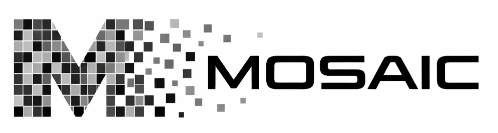
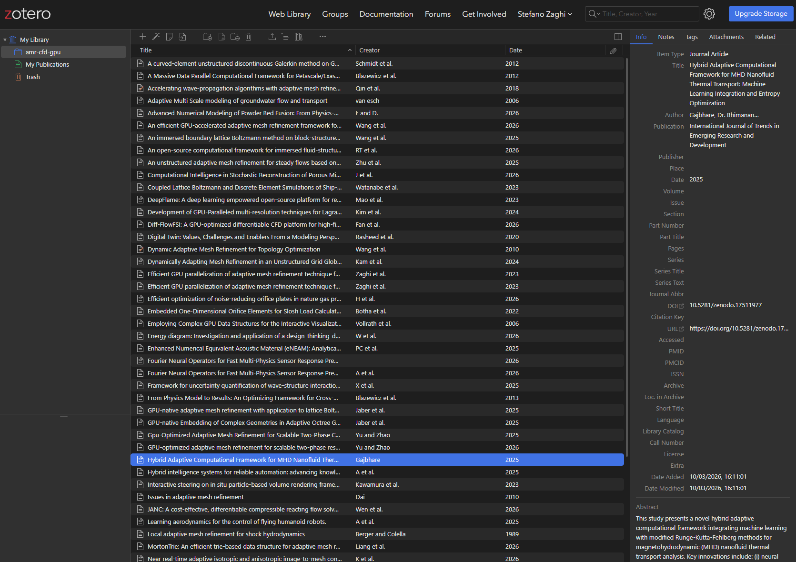
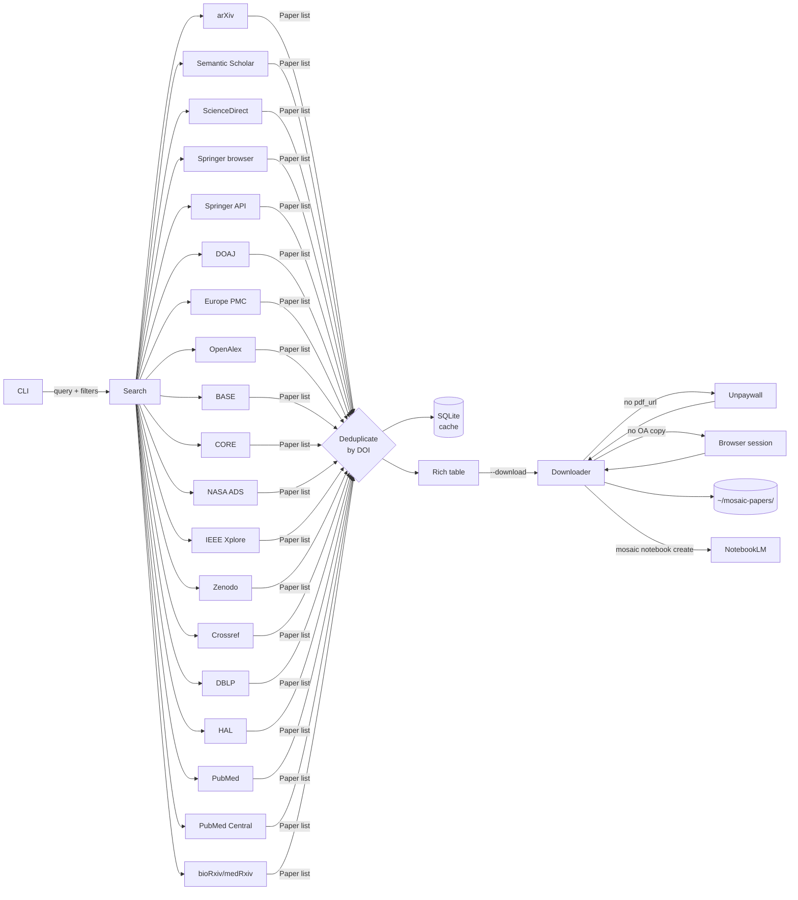

<div align="center">

<picture>
  <source media="(prefers-color-scheme: dark)"  srcset="docs/public/mosaic-logo-alpha-white.png">
  <source media="(prefers-color-scheme: light)" srcset="docs/public/mosaic-logo-alpha-black.png">
  
</picture>

#### *a vivid mosaic of open scientific literature, assembled in seconds*

### Multi-sOurce Scientific Article Indexer and Collector

> Search, discover, and download scientific papers from multiple open databases — with a single command.
> Send results directly to [Google NotebookLM](https://notebooklm.google.com/) for AI-powered summaries, podcasts, and more.

[](https://pypi.org/project/mosaic-search/)
[](https://github.com/szaghi/mosaic/actions/workflows/tests.yml)
[](https://szaghi.github.io/mosaic/)
[](https://www.python.org/)
[](licensing/LICENSE.gpl3.md)
[](licensing/LICENSE.bsd-2.md)
[](licensing/LICENSE.bsd-3.md)
[](licensing/LICENSE.mit.md)
[](https://t.me/mosaic_search)
[](https://t.me/mosaic_search_support)

**[Full documentation](https://szaghi.github.io/mosaic/)**

</div>

---

## What MOSAIC does

```bash
# Search dozens sources at once, deduplicate, download OA PDFs
mosaic search "attention is all you need" --oa-only --download

# Discover related literature from any DOI or arXiv ID — no query needed
mosaic similar 10.48550/arXiv.1706.03762 --sort citations

# Bulk-download your entire Zotero / JabRef library
mosaic get --from refs.bib --oa-only

# Turn results into an AI-powered notebook: podcast, slides, quiz, mind map…
mosaic notebook create "Transformers" --query "transformer architecture" --oa-only --podcast
```


## Authors

**[Stefano Zaghi](https://github.com/szaghi)** · stefano.zaghi@gmail.com
> *Creator & Maintainer*

**[Andrea Giulianini](https://github.com/AndreaGiulianini)**
>*Grand Pixel Overlord & Architect of the Sacred Button* — world-class web UI designer, responsible for making MOSAIC actually look good

**[Claude](https://claude.ai)** (Anthropic)
>*Omniscient Code Oracle & Tireless Rubber Duck* — AI pair programmer, responsible for writing the boring parts so humans don't have to

## Web UI

<div align="center">
<video src="https://szaghi.github.io/mosaic/mosaic-1.3.5-web_ui.mp4" controls width="100%"></video>
</div>

Launch with `mosaic ui` (requires `[ui]` extra — see [Web UI docs](https://szaghi.github.io/mosaic/guide/web-ui)).

## Key features

<div>
<table>
<tr>
<td><b>🌐 Dozens sources, one command</b><br><sub>arXiv · Semantic Scholar · OpenAlex · PubMed · PubMed Central · Europe PMC · DOAJ · Crossref · Springer · IEEE · NASA ADS · Zenodo · BASE · CORE · DBLP · HAL · ScienceDirect · bioRxiv/medRxiv · and more — all with <code>mosaic search "query"</code>. <a href="https://szaghi.github.io/mosaic/guide/sources">Sources guide</a></sub></td>
<td><b>🔭 Find similar papers</b><br><sub><code>mosaic similar &lt;doi&gt;</code> — discover related literature from any DOI or arXiv ID via OpenAlex graph + Semantic Scholar ML, no query needed. <a href="https://szaghi.github.io/mosaic/guide/similar">Find similar guide</a></sub></td>
<td><b>✨ Smart deduplication</b><br><sub>Results merged by DOI: best citation count, richest abstract, earliest PDF URL wins. <a href="https://szaghi.github.io/mosaic/guide/usage">Usage guide</a></sub></td>
</tr>
<tr>
<td><b>📥 OA PDF downloads</b><br><sub>Direct links · Unpaywall fallback · browser-session authenticated access · bulk download from <code>.bib</code>/<code>.csv</code>. <a href="https://szaghi.github.io/mosaic/guide/authenticated-access">Authenticated access guide</a></sub></td>
<td><b>🎛️ Sort &amp; filter</b><br><sub>Year · author · journal · open-access · citation count — composable, applied at API level where supported. <a href="https://szaghi.github.io/mosaic/guide/usage#sort-results">Usage guide</a></sub></td>
<td><b>📤 Export anywhere</b><br><sub>Markdown · CSV · JSON · BibTeX · Zotero (local &amp; web API). <a href="https://szaghi.github.io/mosaic/guide/usage#save-results-to-a-file">Usage guide</a></sub></td>
</tr>
<tr>
<td><b>🤖 NotebookLM integration</b><br><sub>Podcast · video · slides · quiz · mind map · flashcards · briefing — queued in one command with <code>mosaic notebook create</code>. <a href="https://szaghi.github.io/mosaic/guide/notebooklm">NotebookLM guide</a></sub></td>
<td><b>⚡ Offline-first cache</b><br><sub>SQLite — repeated queries are instant, no re-fetching. <code>mosaic search "query" --cached</code> for instant offline search. Combine with <code>--sort relevance</code> to re-rank a local bibliography against any query — no network needed. <a href="https://szaghi.github.io/mosaic/guide/usage#offline--cached-search">Usage guide</a></sub></td>
<td><b>🧩 Custom sources</b><br><sub>Wire any JSON REST API as a new source with a few lines of TOML — no Python needed. <a href="https://szaghi.github.io/mosaic/guide/custom-sources">Custom sources guide</a></sub></td>
</tr>
<tr>
<td><b>🗒️ Obsidian integration</b><br><sub>Write paper notes directly into an Obsidian vault — YAML frontmatter, <code>&gt;[!abstract]</code> callout, metadata table, and <code>[[wikilinks]]</code> to related papers. Existing notes are never overwritten. <a href="https://szaghi.github.io/mosaic/guide/obsidian">Obsidian integration guide</a></sub></td>
<td colspan="2"><b>🆓 FOSS licensing</b><br><sub>Available under your choice of <a href="licensing/LICENSE.gpl3.md">GPL v3</a>, <a href="licensing/LICENSE.bsd-2.md">BSD-2</a>, <a href="licensing/LICENSE.bsd-3.md">BSD-3</a>, or <a href="licensing/LICENSE.mit.md">MIT</a> — use whichever license best fits your project</sub></td>
</tr>
<tr>
<td colspan="3"><b>🧠 Local RAG &amp; literature analysis</b><br><sub>Ask questions, find gaps, compare methods, and extract structured data — fully local with <code>sqlite-vec</code> + any Ollama model. <code>mosaic index</code> → <code>mosaic ask</code> → <code>mosaic chat</code>. No data leaves your machine. <a href="https://szaghi.github.io/mosaic/guide/rag">RAG guide</a></sub></td>
</tr>
<tr>
<td colspan="3"><b>📚 Zotero integration</b><br><sub>Push results directly into your Zotero library — local API (Zotero running on your machine) or web API (<code>api.zotero.org</code>). Organise into collections, link downloaded PDFs as attachments, and sync across devices — all with a single <code>--zotero</code> flag. <a href="https://szaghi.github.io/mosaic/guide/zotero">Zotero integration guide</a></sub></td>
</tr>
</table>
</div>



## Sources

| Source | Shorthand | Coverage | Auth | OA PDF |
|---|---|---|---|---|
| **arXiv** | `arxiv` | Physics, CS, Math, Biology… | None | Always |
| **Semantic Scholar** | `ss` | 214 M papers, all disciplines | Optional key | When indexed |
| **ScienceDirect** | `sd` | Elsevier journals & books | API key or browser session | OA articles |
| **Springer Nature** | `sp` | Springer, Nature & affiliated journals (browser) | None (`[browser]` extra) | Via Unpaywall |
| **Springer Nature API** | `springer` | OA articles from Springer, Nature & affiliated journals | Free API key | Direct PDF link |
| **DOAJ** | `doaj` | 8 M+ fully open-access articles | None | Always |
| **Europe PMC** | `epmc` | 45 M biomedical papers | None | PMC articles |
| **OpenAlex** | `oa` | 250 M+ works, all disciplines | None | When available |
| **BASE** | `base` | 300 M+ docs from 10 000+ repos | None | When OA + PDF format |
| **CORE** | `core` | 200 M+ OA full-text from repos | Free API key | `downloadUrl` field |
| **NASA ADS** | `ads` | 15 M+ astronomy & astrophysics records | Free API token | OA articles |
| **IEEE Xplore** | `ieee` | 5 M+ IEEE journals, transactions & conference proceedings | Free API key | OA articles |
| **Zenodo** | `zenodo` | 3 M+ OA research outputs (papers, datasets, software) | None (token optional) | Attached PDF files |
| **Crossref** | `crossref` | 150 M+ scholarly works (DOI registry) | None (email optional) | When deposited by publisher |
| **DBLP** | `dblp` | 6 M+ CS publications (journals, conferences) | None | Via `ee` field (arXiv/OA links) |
| **HAL** | `hal` | 1.5 M+ OA documents, strong for French academic output | None | Direct PDF when deposited |
| **PubMed** | `pubmed` | 35 M+ biomedical citations (NCBI) | None (API key optional) | PMC PDF for OA articles |
| **PubMed Central** | `pmc` | 5 M+ free full-text biomedical articles | None (API key optional) | Always — all PMC articles are OA |
| **bioRxiv / medRxiv** | `rxiv` | Life-science and medical preprints | None | Always (all preprints are OA) |
| **PEDro** | `pedro` | Physiotherapy evidence database | None (fair-use ack) | No (abstracts only) |
| **Scopus** | `scopus` | 90 M+ abstracts from Elsevier's citation database | API key or browser session | Via Unpaywall |
| **Unpaywall** | — | PDF resolver for any DOI | Email only | Legal OA copy |

## Installation

```bash
# recommended — isolated install, globally available
pipx install mosaic-search        # or: uv tool install mosaic-search
```

```bash
# pip — must be inside a virtualenv (modern systems enforce PEP 668)
python -m venv ~/.venvs/mosaic && source ~/.venvs/mosaic/bin/activate
pip install mosaic-search
```

```bash
# from source
git clone https://github.com/szaghi/mosaic
cd mosaic
python -m venv .venv && source .venv/bin/activate
pip install -e .
```

> Requires Python 3.11+

## Quick Start

```bash
# 1. Set your email (enables Unpaywall PDF fallback)
mosaic config --unpaywall-email you@example.com

# 2. Optional: add an Elsevier API key to unlock ScienceDirect
mosaic config --elsevier-key YOUR_KEY

# 3. Search and download
mosaic search "transformer architecture" --oa-only --download
```


## Usage

### Search

```bash
# Search all enabled sources (10 results per source by default)
mosaic search "protein folding"

# More results, open-access only
mosaic search "deep learning" -n 25 --oa-only

# Single source
mosaic search "RNA velocity" --source epmc

# Search only the local cache — instant, no network
mosaic search "attention mechanism" --cached

# Re-rank a local bibliography by relevance — no network, no API keys
mosaic get --from refs.bib                             # load .bib into cache once
mosaic search "transformer attention" --cached --sort relevance
```

**Source shorthands:** `arxiv` · `ss` · `sd` · `doaj` · `epmc` · `oa` · `base` · `core` · `sp` · `springer` · `ads` · `ieee` · `zenodo` · `crossref` · `dblp` · `hal` · `pubmed` · `pmc` · `rxiv` · `pedro` · `scopus`

Custom sources defined in `config.toml` are also queried and addressable by their `name`.

### Filters

```bash
# By year — single, range, or list
mosaic search "BERT" --year 2019
mosaic search "diffusion models" -y 2020-2023
mosaic search "GPT" -y 2020,2022,2024

# By author (repeatable, OR logic, case-insensitive substring)
mosaic search "attention" -a Vaswani -a Shazeer

# By journal (case-insensitive substring)
mosaic search "CRISPR" --journal "Nature"

# Combine freely
mosaic search "graph neural" -y 2021-2023 -a Kipf -j "ICLR" --oa-only --download
```

### Find similar papers

```bash
# Discover related literature from any DOI or arXiv ID
mosaic similar 10.48550/arXiv.1706.03762

# Sort by citation count, open-access only
mosaic similar arxiv:1706.03762 -n 20 --sort citations --oa-only

# Save to BibTeX
mosaic similar 10.1038/s41586-021-03819-2 --output related.bib
```

Uses **OpenAlex** `related_works` (always) and **Semantic Scholar** recommendations (when `ss-key` is configured). Results are deduplicated and merged — the higher citation count and richer metadata always win.

### Download by DOI

```bash
mosaic get 10.48550/arXiv.1706.03762
```

Checks the local cache first — if the paper was seen in a previous search and a PDF URL is already known, downloads immediately without hitting Unpaywall.

### Bulk download from BibTeX / CSV

```bash
# Export your Zotero/JabRef/Mendeley library and download everything
mosaic get --from refs.bib

# CSV with a 'doi' column works too
mosaic get --from references.csv --oa-only
```

Extracts all DOIs from the file, deduplicates, and downloads with the same fallback chain (direct PDF → Unpaywall → browser session).

### Export to Zotero

```bash
# Push to your Zotero library (Zotero must be running — no config needed)
mosaic search "CRISPR" --oa-only --zotero

# Push to a named collection (created automatically if missing)
mosaic search "transformers" --zotero --zotero-collection "Deep Learning"

# Download PDFs and link them as Zotero attachments (local mode)
mosaic search "diffusion models" --download --zotero --zotero-collection "Generative AI"
```

For the **web API** (Zotero not running locally), configure once:
```bash
mosaic config --zotero-key YOUR_API_KEY
```


### Configuration

```bash
mosaic config --show                          # print current config
mosaic config --unpaywall-email me@uni.edu
mosaic config --elsevier-key abc123
mosaic config --ss-key xyz789
mosaic config --download-dir ~/papers
```

Config is stored at `~/.config/mosaic/config.toml`. Downloaded PDFs go to `~/mosaic-papers/` by default.

### Custom sources

Any number of JSON REST APIs can be added as new sources directly in `config.toml` — one `[[custom_sources]]` block per source, no Python required:

```toml
[[custom_sources]]
name         = "My Institution Repo"
enabled      = true
url          = "https://repo.myuni.edu/api/search"
method       = "GET"
query_param  = "q"
results_path = "results"

[custom_sources.fields]
title    = "title"
doi      = "doi"
year     = "year"
authors  = "authors"    # flat string array
journal  = "source.title"
```

See the [Custom Sources guide](https://szaghi.github.io/mosaic/guide/custom-sources) for the full reference.

### NotebookLM

Send search results directly to a Google NotebookLM notebook:

```bash
# 1. Inject into MOSAIC (--include-apps exposes the notebooklm CLI)
pipx inject --include-apps mosaic-search "notebooklm-py[browser]"

# 2. Install Chromium — playwright lives inside the pipx venv, call it directly
~/.local/share/pipx/venvs/mosaic-search/bin/playwright install chromium

# 3. Authenticate once
notebooklm login

# 4. Search, download, and create a notebook in one command
mosaic notebook create "Transformers" --query "transformer architecture" --oa-only --podcast

# Or import PDFs you already have
mosaic notebook create "My Papers" --from-dir ~/mosaic-papers/
```

MOSAIC uploads local PDFs when available, falls back to URLs otherwise, and respects NotebookLM's 50-source limit. With `--podcast`, an Audio Overview is queued automatically.

## Architecture



## Community

| | |
|---|---|
| 📢 **Announcements** | [t.me/mosaic_search](https://t.me/mosaic_search) — releases, CI events, weekly digest |
| 💬 **Support group** | [t.me/mosaic_search_support](https://t.me/mosaic_search_support) — questions, bug reports, discussion |

The support group has a bot that responds instantly to `/help`, `/install`, `/version`, `/docs`, `/sources`, `/changelog`, `/bug`, and `/roadmap`, and auto-replies to common questions.

## Development

```bash
pip install -e ".[dev]"

# with NotebookLM integration (includes Playwright for auth)
pip install -e ".[dev,notebooklm]"
playwright install chromium

# run tests + coverage
pytest

# live docs
cd docs && npm install && npm run docs:dev
```

Coverage report and badge JSON are written to `docs/public/` after every test run.

### Testing local changes with a pipx install

If you run MOSAIC via `pipx install mosaic-search` and want to test local changes
without affecting your stable install, use `make dev`:

```bash
make dev   # reinstalls from source into the pipx venv (no-deps, instant)
```

**New dependency added to `pyproject.toml`?** `make dev` skips dependency installation.
Inject the new package into the pipx venv once:

```bash
pipx inject mosaic-search <new-package>
```

## License

MOSAIC is available under your choice of license:

| License | SPDX | File |
|---|---|---|
| GNU General Public License v3 | `GPL-3.0-or-later` | [LICENSE.gpl3.md](licensing/LICENSE.gpl3.md) |
| BSD 2-Clause | `BSD-2-Clause` | [LICENSE.bsd-2.md](licensing/LICENSE.bsd-2.md) |
| BSD 3-Clause | `BSD-3-Clause` | [LICENSE.bsd-3.md](licensing/LICENSE.bsd-3.md) |
| MIT | `MIT` | [LICENSE.mit.md](licensing/LICENSE.mit.md) |

© [Stefano Zaghi](https://github.com/szaghi)
