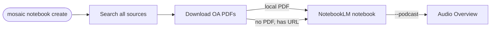

# NotebookLM Integration

MOSAIC can create and populate [Google NotebookLM](https://notebooklm.google.com/) notebooks directly from search results. After finding and downloading open-access PDFs, MOSAIC imports them into a new notebook — ready for AI-powered Q&A, summaries, quizzes, and audio overviews.

::: warning Unofficial integration
This feature uses [notebooklm-py](https://github.com/teng-lin/notebooklm-py), an unofficial Python client for NotebookLM. Google may change internal APIs without notice. Use for personal projects and research.
:::

## Setup

### 1. Install notebooklm-py

[notebooklm-py](https://github.com/teng-lin/notebooklm-py) must be installed with its `[browser]` extra, which pulls in [Playwright](https://playwright.dev/python/) for the Google sign-in flow:

```bash
pip install "notebooklm-py[browser]"
playwright install chromium
```

### 2. Install the MOSAIC extra

```bash
# if you installed MOSAIC with pipx
pipx inject mosaic-search notebooklm-py

# if you installed MOSAIC with pip (inside your venv)
pip install 'mosaic-search[notebooklm]'

# if you installed MOSAIC with uv
uv tool inject mosaic-search notebooklm-py
```

::: tip One package, two install steps
`notebooklm-py[browser]` is only needed **once** for authentication. After sign-in, MOSAIC uses the stored credentials and does not require Playwright at runtime. If you only want to authenticate once and then use a different machine, you can copy `~/.config/notebooklm/` across.
:::

### 3. Authenticate (one-time)

```bash
notebooklm login
```

This opens a Chromium browser window for Google sign-in. Credentials are stored in `~/.config/notebooklm/` and reused automatically on every subsequent `mosaic notebook` call.

If you are ever signed out, re-run `notebooklm login`.

## Usage

### From a search query

Search, download, and import in one command:

```bash
# Search all sources, download OA PDFs, create notebook
mosaic notebook create "Attention Mechanisms" \
    --query "attention is all you need" \
    --oa-only --max 10

# Also queue an Audio Overview (podcast)
mosaic notebook create "Transformers Survey" \
    --query "transformer architecture survey 2023" \
    --oa-only --podcast
```

### From a local directory

If you already have PDFs downloaded, import them directly:

```bash
mosaic notebook create "My Reading List" --from-dir ~/mosaic-papers/
```

### Full option reference

| Option | Default | Description |
|--------|---------|-------------|
| `NAME` | *(required)* | Notebook name |
| `--query`, `-q` | — | Search query (alternative to `--from-dir`) |
| `--from-dir` | — | Directory of PDFs to import (alternative to `--query`) |
| `--max`, `-n` | `10` | Max results per source when using `--query` |
| `--oa-only` | off | Only include open-access papers |
| `--podcast` | off | Queue an Audio Overview after import |

## What happens under the hood



1. MOSAIC searches all enabled sources with the given query.
2. For each result, it attempts to download the PDF (with Unpaywall fallback).
3. Papers with a local PDF are uploaded as files; the rest are added by URL.
4. Up to 50 sources are imported (NotebookLM's hard limit).
5. If `--podcast` is set, an Audio Overview is queued — it appears in NotebookLM Studio in a few minutes.

## Typical workflow

```bash
# 1. Find and collect papers on a topic
mosaic notebook create "Protein Folding 2024" \
    --query "protein structure prediction alphafold" \
    --oa-only --max 15 --podcast

# 2. Open the link printed by MOSAIC in your browser
# 3. Chat with the notebook, generate quizzes, flashcards, study guides…
```

## Notes

- **Source limit**: NotebookLM accepts at most 50 sources per notebook. For larger result sets, only the first 50 are imported.
- **Podcast timing**: Audio Overview generation takes 5–15 minutes. The notebook is usable immediately while the podcast renders in the background.
- **Credentials**: `notebooklm login` stores a session cookie locally. Re-run if you are signed out.
