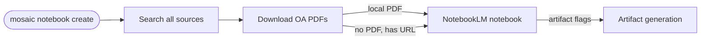

# NotebookLM Integration

MOSAIC can create and populate [Google NotebookLM](https://notebooklm.google.com/) notebooks directly from search results. After finding and downloading open-access PDFs, MOSAIC imports them into a new notebook — ready for AI-powered Q&A, summaries, quizzes, and audio overviews.

::: warning Unofficial integration
This feature uses [notebooklm-py](https://github.com/teng-lin/notebooklm-py), an unofficial Python client for NotebookLM. Google may change internal APIs without notice. Use for personal projects and research.
:::

## Setup

### 1. Inject notebooklm-py into MOSAIC

`--include-apps` exposes the `notebooklm` CLI to your PATH. `[browser]` pulls in Playwright, which is needed for the one-time Google sign-in.

```bash
# pipx
pipx inject --include-apps mosaic-search "notebooklm-py[browser]"

# uv
uv tool inject --include-apps mosaic-search "notebooklm-py[browser]"

# pip / venv (activate your venv first)
pip install "notebooklm-py[browser]"
```

### 2. Install the Chromium browser (one-time)

Playwright is installed inside the MOSAIC tool venv but its own CLI is not exposed to PATH by pipx/uv. Download the Chromium binary by calling it directly from the venv:

```bash
# pipx
~/.local/share/pipx/venvs/mosaic-search/bin/playwright install chromium

# uv
~/.local/share/uv/tools/mosaic-search/bin/playwright install chromium

# pip / venv (playwright is on PATH inside the activated venv)
playwright install chromium
```

This is a ~150 MB one-time download to `~/.cache/ms-playwright/`.

### 3. Authenticate (one-time)

```bash
notebooklm login
```

A Chromium window opens for Google sign-in. After logging in, press **Enter** in the terminal. Credentials are saved to `~/.notebooklm/` and reused automatically by every future `mosaic notebook` call.

::: tip
After the first sign-in, Playwright and Chromium are never invoked again. You can also copy `~/.notebooklm/` to another machine to skip re-authentication.
:::

### 3. Authenticate (one-time)

```bash
notebooklm login
```

This opens a Chromium browser window for Google sign-in. Credentials are stored in `~/.config/notebooklm/` and reused automatically on every subsequent `mosaic notebook` call.

If you are ever signed out, re-run `notebooklm login`.

## Usage

### From a search query

Search, download, and import in one command:

```bash
# Search all sources, download OA PDFs, create notebook
mosaic notebook create "Attention Mechanisms" \
    --query "attention is all you need" \
    --oa-only --max 10

# Queue an Audio Overview (podcast) after import
mosaic notebook create "Transformers Survey" \
    --query "transformer architecture survey 2023" \
    --oa-only --podcast

# Queue multiple artifacts at once
mosaic notebook create "CRISPR 2024" \
    --query "CRISPR gene editing 2024" \
    --oa-only --briefing --quiz --mind-map
```

### From a local directory

If you already have PDFs downloaded, import them directly:

```bash
mosaic notebook create "My Reading List" --from-dir ~/mosaic-papers/

# Import and queue a slide deck
mosaic notebook create "My Reading List" --from-dir ~/mosaic-papers/ --slide-deck
```

### Artifact generation flags

After the notebook is populated, MOSAIC can queue one or more AI-generated artifacts.
All flags are optional and can be combined freely. Artifacts are queued immediately
after the notebook is created and generated asynchronously by NotebookLM — check the
notebook in a few minutes.

| Flag | Artifact type |
|------|--------------|
| `--podcast` | Audio Overview (podcast) |
| `--video` | Video Overview |
| `--briefing` | Briefing Doc |
| `--study-guide` | Study Guide |
| `--quiz` | Quiz |
| `--flashcards` | Flashcards |
| `--infographic` | Infographic |
| `--slide-deck` | Slide Deck |
| `--data-table` | Data Table |
| `--mind-map` | Mind Map |

#### Audio Overview (`--podcast`)

A conversational AI-generated podcast — two synthetic hosts discuss the key findings,
debates, and open questions across all sources in the notebook. Typical length is
10–20 minutes. Ideal for absorbing a body of literature while commuting or away from
a screen. The audio file can be downloaded from the NotebookLM Studio panel.

**Best for:** broad literature surveys, getting a high-level feel for a new topic.

```bash
mosaic notebook create "Diffusion Models" \
    --query "diffusion probabilistic models image generation" \
    --oa-only --podcast
```

#### Video Overview (`--video`)

A short video presentation — an AI avatar narrates a visual summary of the notebook
sources, similar to the Audio Overview but with synchronized slides or imagery.
Rendered as an MP4 that can be downloaded or shared.

**Best for:** visual learners; presentations where a recorded explainer is more
engaging than a written summary.

```bash
mosaic notebook create "AlphaFold Review" \
    --query "alphafold protein structure 2023" \
    --oa-only --video
```

#### Briefing Doc (`--briefing`)

A structured prose document — typically 2–5 pages — that synthesises the most
important themes, claims, and supporting evidence found across the sources. Sections
cover background, key findings, points of consensus, open questions, and a short
conclusion. Exported as formatted text you can copy into a report or share directly.

**Best for:** quick executive summaries; writing literature-review introductions;
getting up to speed before a meeting.

```bash
mosaic notebook create "CRISPR Therapeutics" \
    --query "CRISPR in vivo gene therapy clinical trial" \
    --oa-only -y 2022-2025 --briefing
```

#### Study Guide (`--study-guide`)

A learning-oriented document organised around key concepts, definitions, and review
questions. NotebookLM structures the material as an outline with subsections per
concept, each accompanied by a plain-language explanation grounded in the sources.
Suitable for exam preparation or onboarding new team members.

**Best for:** teaching a topic, onboarding, systematic self-study.

```bash
mosaic notebook create "Reinforcement Learning Basics" \
    --query "reinforcement learning policy gradient survey" \
    --oa-only --study-guide
```

#### Quiz (`--quiz`)

A set of multiple-choice and short-answer questions drawn directly from the notebook
sources, complete with correct answers and source citations. Difficulty and quantity
are chosen automatically by NotebookLM based on the content. Questions can be used
as-is for self-assessment or adapted into a formal assessment.

**Best for:** self-testing comprehension; generating questions for a journal club or
course assignment.

```bash
mosaic notebook create "Attention Mechanisms" \
    --query "self-attention transformer architecture" \
    --oa-only --quiz
```

#### Flashcards (`--flashcards`)

A deck of term/definition or question/answer cards extracted from the sources.
Each card is concise — front side poses a concept or question, back side gives the
answer with a brief explanation. The deck can be reviewed inside NotebookLM or
exported for import into Anki or similar spaced-repetition tools.

**Best for:** memorising terminology, methods, or key facts from a dense literature.

```bash
mosaic notebook create "Genomics Terminology" \
    --query "single cell RNA sequencing methods review" \
    --oa-only --flashcards
```

#### Infographic (`--infographic`)

A single-page visual summary — key statistics, findings, and relationships rendered
as a designed graphic with icons, callouts, and short text blocks. Produced as an
image file (PNG or PDF). Layout and detail level are chosen automatically.

**Best for:** posters, social media summaries, slide backgrounds, or any context
where a dense text document is not appropriate.

```bash
mosaic notebook create "Climate Models 2024" \
    --query "climate model uncertainty projection 2024" \
    --oa-only --infographic
```

#### Slide Deck (`--slide-deck`)

A presentation exported as a set of slides (Google Slides format or equivalent),
covering the topic from introduction through methodology, key results, and
conclusions. Each slide has a title, bullet points, and — where appropriate —
placeholder notes for a speaker. Ready to open, customise, and present.

**Best for:** conference talks, group seminars, lab meetings, course lectures.

```bash
mosaic notebook create "Graph Neural Networks" \
    --query "graph neural network survey applications" \
    --oa-only -y 2021-2025 --slide-deck
```

#### Data Table (`--data-table`)

A structured table that extracts comparable data points — numbers, metrics,
experimental conditions, model names, benchmark scores, dates — from the sources and
aligns them in rows and columns. Useful for spotting trends, comparing methods, or
preparing a results table for a paper.

**Best for:** systematic reviews, benchmark comparisons, meta-analyses.

```bash
mosaic notebook create "LLM Benchmarks" \
    --query "large language model benchmark evaluation 2024" \
    --oa-only --data-table
```

#### Mind Map (`--mind-map`)

An interactive, zoomable graph of concepts, sub-topics, and the relationships between
them, extracted from the notebook sources. Nodes represent ideas or entities; edges
show how they connect. Viewable and navigable inside NotebookLM Studio.

**Best for:** exploring a new field, identifying gaps, planning a research agenda,
or explaining a complex topic visually.

```bash
mosaic notebook create "Metabolomics Overview" \
    --query "metabolomics mass spectrometry data analysis" \
    --oa-only --mind-map
```

### Full option reference

| Option | Default | Description |
|--------|---------|-------------|
| `NAME` | *(required)* | Notebook name |
| `--query`, `-q` | — | Search query (alternative to `--from-dir`) |
| `--from-dir` | — | Directory of PDFs to import (alternative to `--query`) |
| `--max`, `-n` | `10` | Max results per source when using `--query` |
| `--oa-only` | off | Only include open-access papers |
| `--pdf-only` | off | Only include papers with a known PDF URL |
| `--year`, `-y` | — | Year filter (same formats as `search`) |
| `--author`, `-a` | — | Author filter, repeatable |
| `--journal`, `-j` | — | Journal name substring filter |
| `--field`, `-f` | `all` | Scope query to `title`, `abstract`, or `all` |
| `--raw-query` | — | Raw query sent directly to APIs, bypasses all transforms |
| `--download-dir` | config | Override PDF download directory for this run only |
| `--podcast` | off | Queue an Audio Overview after import |
| `--video` | off | Queue a Video Overview after import |
| `--briefing` | off | Queue a Briefing Doc after import |
| `--study-guide` | off | Queue a Study Guide after import |
| `--quiz` | off | Queue a Quiz after import |
| `--flashcards` | off | Queue Flashcards after import |
| `--infographic` | off | Queue an Infographic after import |
| `--slide-deck` | off | Queue a Slide Deck after import |
| `--data-table` | off | Queue a Data Table after import |
| `--mind-map` | off | Queue a Mind Map after import |

## What happens under the hood



1. MOSAIC searches all enabled sources with the given query.
2. For each result, it attempts to download the PDF (with Unpaywall fallback).
3. Papers with a local PDF are uploaded as files; the rest are added by URL.
4. Up to 50 sources are imported (NotebookLM's hard limit).
5. Any artifact flags (`--podcast`, `--briefing`, etc.) are queued — they appear in NotebookLM Studio within a few minutes.

## Typical workflow

```bash
# 1. Find and collect papers on a topic
mosaic notebook create "Protein Folding 2024" \
    --query "protein structure prediction alphafold" \
    --oa-only --max 15 --podcast --briefing

# 2. Open the link printed by MOSAIC in your browser
# 3. Chat with the notebook; review the briefing doc and listen to the podcast
```

## Notes

- **Source limit**: NotebookLM accepts at most 50 sources per notebook. For larger result sets, only the first 50 are imported.
- **Artifact timing**: Generation takes a few minutes. The notebook is usable immediately while artifacts render in the background.
- **Credentials**: `notebooklm login` stores a session cookie locally. Re-run if you are signed out.
