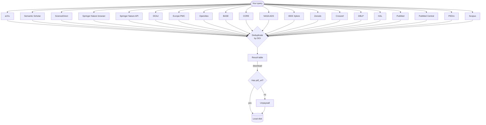

# Sources

MOSAIC aggregates results from multiple bibliographic databases plus one PDF resolver.



## arXiv

| Property | Value |
|----------|-------|
| Auth | None |
| Content | Preprints — physics, maths, CS, biology, economics |
| PDF | Always available (all arXiv papers are OA) |
| Rate limit | 3 s between requests, max 2 000/page, 30 000 total |
| Base URL | `https://export.arxiv.org/api/query` |

arXiv is the best source for recent preprints and CS/physics papers. Because everything on arXiv is open access, `--oa-only` has no effect on arXiv results.

**Search fields supported:** `all:`, `ti:` (title), `au:` (author), `abs:` (abstract), `cat:` (category), `jr:` (journal ref)

```bash
mosaic search "ti:attention au:vaswani" --source arxiv
```

## Semantic Scholar

| Property | Value |
|----------|-------|
| Auth | Optional API key |
| Content | 214 million papers across all disciplines |
| PDF | `openAccessPdf.url` when available |
| Rate limit | 1 000 req/s (shared, no key) · 1 req/s (dedicated, with key) |
| Base URL | `https://api.semanticscholar.org/graph/v1` |

Semantic Scholar is the broadest source. Its `openAccessPdf` field provides a direct PDF link whenever Semantic Scholar has indexed a legal copy. Set an API key in the config for a private rate-limit slot.

To obtain a key, go to [semanticscholar.org/product/api](https://www.semanticscholar.org/product/api), scroll to **"Get API Key"**, fill in your name, email, and a brief use-case description. The key is issued automatically by email — usually within minutes, no institutional affiliation required. Apply it with `mosaic config --ss-key YOUR_KEY`.

## ScienceDirect

| Property | Value |
|----------|-------|
| Auth | API key **or** saved browser session |
| Content | Elsevier journals and books |
| PDF | Open-access articles (API mode); Unpaywall fallback (browser mode) |
| Rate limit | 20 000–50 000 req/week, 2–10 req/s (API) · browser-paced (session) |
| Base URL | `https://api.elsevier.com/content/search/sciencedirect` (API) · `https://www.sciencedirect.com/search` (browser) |

MOSAIC selects the access mode automatically:

- **API key configured** — uses the Elsevier Article Search API. Fast and reliable. By default only open-access content is returned; full-text access to subscribed content requires an institutional token or campus/VPN IP.
- **Browser session saved, no API key** — uses headless Firefox to search `sciencedirect.com` with your institutional credentials. Returns results from subscribed content. PDF download via the session is blocked by Cloudflare on the `/pdfft/` endpoint; Unpaywall is used as fallback.
- **Neither** — source is skipped entirely.

::: tip Setup
- API key: `mosaic config --elsevier-key YOUR_KEY` — register free at [dev.elsevier.com](https://dev.elsevier.com)
- Browser session: see [Authenticated Access → ScienceDirect](./authenticated-access#sciencedirect-elsevier)
:::

## Springer Nature (browser) — shorthand `sp`

| Property | Value |
|----------|-------|
| Auth | None (publicly accessible) |
| Content | Springer, Nature, and affiliated journals and book series |
| PDF | Via Unpaywall or browser session (institutional access) |
| Rate limit | Browser-paced — one page load per request |
| Base URL | `https://link.springer.com/search` |

Springer Nature's search results are fully JavaScript-rendered, so MOSAIC uses a headless Firefox browser to fetch them. No login or API key is needed — the search interface is publicly accessible.

The source activates automatically whenever Playwright is installed (`pip install 'mosaic-search[browser]'`). It is disabled if the `[browser]` extra is not available.

Supports `--field title` (searches the article title field natively), `--year`, `--max` (with automatic page-by-page navigation for `--max > 20`), and `--journal` (appended to the keyword query).

DOIs are extracted directly from the article URLs in the search results.

::: tip CLI shorthand
```bash
mosaic search "adaptive mesh refinement" --source sp --field title --year 2020-2025
```
:::

::: info PDF access
For open-access articles, Unpaywall resolves a direct PDF link. For
subscribed content, a saved Springer browser session is used as a download
fallback — see [Authenticated Access](./authenticated-access).
:::

## Springer Nature (API) — shorthand `springer`

| Property | Value |
|----------|-------|
| Auth | API key required (free — register at [dev.springernature.com](https://dev.springernature.com)) |
| Content | Open-access articles from Springer, Nature, and affiliated journals |
| PDF | Direct PDF link from the `url` array when deposited |
| Rate limit | 5 000 req/day (free tier) |
| Base URL | `https://api.springernature.com/openaccess/json` |

The official Springer Nature Open Access API returns only freely accessible articles and includes direct PDF links when the publisher has deposited them. This source is faster and more reliable than the browser source but requires a free API key and is limited to OA content.

Supports `--field title` (uses the native `title:` query prefix), `--year` (appended as `date:YYYY-YYYY`), and `--max` (capped at 100 per request). Author and journal filters are applied as post-processing.

Both Springer sources can be active simultaneously; results are deduplicated by DOI.

::: tip Setup
Register for a free API key at [dev.springernature.com](https://dev.springernature.com), then add it to the config:

```toml
# ~/.config/mosaic/config.toml
[sources.springer_api]
api_key = "YOUR_KEY"
```
:::

::: tip CLI shorthand
```bash
mosaic search "protein folding" --source springer --field title --year 2020-2025
```
:::

## DOAJ

| Property | Value |
|----------|-------|
| Auth | None |
| Content | 100 % open-access journals (8 million+ articles) |
| PDF | Link included when published by a DOAJ-indexed journal |
| Rate limit | 2 req/s |
| Base URL | `https://doaj.org/api/v3/search/articles` |

Every result from DOAJ is fully open access by definition. Good source for humanities and social sciences in addition to STEM.

## Europe PMC

| Property | Value |
|----------|-------|
| Auth | None |
| Content | 45 million biomedical and life-science articles |
| PDF | PMC full-text PDF for open-access articles |
| Rate limit | No documented hard limit |
| Base URL | `https://www.ebi.ac.uk/europepmc/webservices/rest/search` |

Europe PMC is the best source for biomedical literature. Open-access papers with a PubMed Central ID (PMCID) include a direct PDF link.

## OpenAlex

| Property | Value |
|----------|-------|
| Auth | None (email optional) |
| Content | 250 million+ works across all disciplines |
| PDF | `best_oa_location.pdf_url` when available |
| Rate limit | 100 000 req/day (anonymous) · higher with polite-pool email |
| Base URL | `https://api.openalex.org/works` |

OpenAlex is the broadest freely available bibliographic database, covering journals, conference papers, books, datasets, and preprints across all disciplines. It is the successor to Microsoft Academic Graph.

When you set an Unpaywall email in the config, MOSAIC reuses it as the OpenAlex [polite-pool](https://docs.openalex.org/how-to-use-the-api/rate-limits-and-authentication) identifier, which grants significantly higher rate limits.

Abstracts in OpenAlex are stored as inverted indices (due to publisher licensing). MOSAIC reconstructs them automatically into plain text.

::: tip CLI shorthand
```bash
mosaic search "transformer" --source oa
```
:::

## BASE (Bielefeld Academic Search Engine)

| Property | Value |
|----------|-------|
| Auth | None |
| Content | 300 million+ documents from 10 000+ content providers |
| PDF | Direct PDF link when source format is `application/pdf` and OA |
| Rate limit | No documented hard limit — use responsibly |
| Base URL | `https://api.base-search.net/cgi-bin/BaseHttpSearchInterface.fcgi` |

BASE aggregates metadata from institutional repositories, open-access journals, and digital libraries worldwide. It is particularly strong for grey literature, theses, and documents not indexed by journal-centric databases.

Search queries support Lucene syntax. Filters for author (`dccreator`), journal (`dcsource`), and year (`dcyear`) are appended natively.

::: tip CLI shorthand
```bash
mosaic search "climate change" --source base
```
:::

## CORE

| Property | Value |
|----------|-------|
| Auth | API key required (free — register at [core.ac.uk/services/api](https://core.ac.uk/services/api)) |
| Content | 200 million+ OA full-text documents from 10 000+ repositories |
| PDF | `downloadUrl` field — CORE's recommended full-text link |
| Rate limit | Varies by tier; free academic key gives generous limits |
| Base URL | `https://api.core.ac.uk/v3/search/works` |

CORE aggregates open-access full text from institutional repositories, preprint servers, and OA journals worldwide. Unlike BASE, CORE focuses exclusively on OA content and always provides a `downloadUrl` pointing to the actual document — making it the most reliable source for direct PDF access.

Filters for author (`authors.name`), journal (`journals.title`), and year (`yearPublished`) are applied natively in the query.

::: warning API key required
CORE is disabled until you set an API key:
```bash
# Edit ~/.config/mosaic/config.toml
[sources.core]
api_key = "YOUR_FREE_KEY"
```
Register for a free key at [core.ac.uk/services/api](https://core.ac.uk/services/api).
:::

::: tip CLI shorthand
```bash
mosaic search "open access publishing" --source core
```
:::

## NASA ADS (Astrophysics Data System)

| Property | Value |
|----------|-------|
| Auth | API key required (free — register at [ui.adsabs.harvard.edu](https://ui.adsabs.harvard.edu/user/settings/token)) |
| Content | 15 million+ records in astronomy, astrophysics, planetary science, physics, and geosciences |
| PDF | Via bibcode gateway link for open-access articles |
| Rate limit | 5 000 req/day |
| Base URL | `https://api.adsabs.harvard.edu/v1/search/query` |

NASA ADS is the definitive database for astronomy and astrophysics literature, operated by the Smithsonian Astrophysical Observatory under a NASA grant. It covers journal articles, conference proceedings, preprints, and grey literature with strong links to arXiv copies.

Open-access articles include a PDF URL constructed from the ADS bibcode (`link_gateway`). ArXiv IDs are extracted from the `identifier` field when present.

::: warning API key required
NASA ADS is disabled until you set an API token. Registration is free:

1. Sign in at [ui.adsabs.harvard.edu](https://ui.adsabs.harvard.edu)
2. Go to **Settings → API Token** and generate a token
3. Add it to the config file:

```toml
# ~/.config/mosaic/config.toml
[sources.nasa_ads]
api_key = "YOUR_TOKEN"
```
:::

::: tip CLI shorthand
```bash
mosaic search "gravitational waves" --source ads
```
:::

## Zenodo

| Property | Value |
|----------|-------|
| Auth | None (access token optional) |
| Content | 3 M+ open research outputs — papers, datasets, software, posters, theses |
| PDF | Direct download link when a PDF file is attached to the record |
| Rate limit | 60 req/min (anonymous) · higher with access token |
| Base URL | `https://zenodo.org/api/records` |

Zenodo is CERN's open-access repository, hosting research outputs from CERN and EU-funded projects across all disciplines. Every record in Zenodo is open access by definition. It is particularly strong for datasets, software, grey literature, and research outputs that are not published in traditional journals.

Search results are limited to `resource_type.type=publication` to exclude datasets and software entries.

When a PDF file is attached to a record, MOSAIC extracts its direct download URL from the `files` array.

::: tip CLI shorthand
```bash
mosaic search "climate data" --source zenodo
```
:::

::: tip Optional access token
Anonymous requests are limited to 60 req/min. A free personal access token raises this limit:

1. Sign in at [zenodo.org](https://zenodo.org)
2. Go to **Settings → Applications → Personal access tokens** and create a token with `deposit:read` scope
3. Add it to the config file:

```toml
# ~/.config/mosaic/config.toml
[sources.zenodo]
api_key = "YOUR_TOKEN"
```
:::

## Crossref

| Property | Value |
|----------|-------|
| Auth | None (email optional) |
| Content | 150 M+ scholarly works — journal articles, conference papers, books, datasets |
| PDF | Direct PDF link when deposited by the publisher in the `link` array |
| Rate limit | 50 req/s with polite-pool email |
| Base URL | `https://api.crossref.org/works` |

Crossref is the primary DOI registration agency for scholarly publishing. Its REST API exposes rich metadata for works deposited by member publishers, including title, authors, publication date, abstract (when provided), journal name, and publisher-deposited PDF links. Abstract coverage varies widely by publisher; many records have no abstract at all.

Field scoping: `--field title` uses the `query.title` parameter; `--field abstract` uses `query.bibliographic` (the closest available equivalent). Year, author, and journal filters are applied as post-processing.

When you set an Unpaywall email in the config, MOSAIC reuses it as the Crossref polite-pool identifier — no separate key is needed.

::: tip CLI shorthand
```bash
mosaic search "transformer attention" --source crossref
```
:::

## HAL

| Property | Value |
|----------|-------|
| Auth | None |
| Content | 1.5 M+ OA documents — strong for French academic output and grey literature |
| PDF | Direct PDF when deposited (`fileMain_s`) |
| Rate limit | No documented hard limit — use responsibly |
| Base URL | `https://api.archives-ouvertes.fr/search/` |

HAL (Hyper Articles en Ligne) is the French national open archive operated by CCSD, covering publications from French research institutions and laboratories. It is particularly strong for grey literature, theses, and conference papers from the French academic community. The API natively supports Lucene/SOLR query syntax, enabling precise field-scoped searches and compound filters.

Field scoping: `--field title` uses the `title_s:` Lucene prefix; `--field abstract` uses `abstract_s:`. Year, author, and journal filters are applied natively in the query string.

::: tip CLI shorthand
```bash
mosaic search "machine learning" --source hal
mosaic search "intelligence artificielle" --source hal --field title --year 2020-2025
```
:::

## IEEE Xplore

| Property | Value |
|----------|-------|
| Auth | API key required (free — register at [developer.ieee.org](https://developer.ieee.org)) |
| Content | 5 M+ IEEE journals, transactions, magazines, and conference proceedings |
| PDF | Direct `pdf_url` field for open-access articles |
| Rate limit | 200 req/day (free tier) |
| Base URL | `https://ieeexploreapi.ieee.org/api/v1/search/articles` |

IEEE Xplore is the primary source for electrical engineering, computer science, and electronics literature published by IEEE. It covers decades of IEEE Transactions, conference proceedings, and standards documents.

Supports `--field title` (uses the native `title:` query prefix), `--field abstract` (uses `abstract:` prefix), and `--year` (sent as native `start_year` / `end_year` parameters). Author and journal filters are applied as post-processing.

::: warning API key required
IEEE Xplore is disabled until you set an API key. Registration is free:

1. Sign up at [developer.ieee.org](https://developer.ieee.org)
2. Create an application to obtain an API key
3. Add it to the config file:

```toml
# ~/.config/mosaic/config.toml
[sources.ieee]
api_key = "YOUR_KEY"
```
:::

::: tip CLI shorthand
```bash
mosaic search "deep learning hardware" --source ieee --field title --year 2020-2025
```
:::

## DBLP

| Property | Value |
|----------|-------|
| Auth | None |
| Content | 6 M+ CS publications — journals, conferences, workshops |
| PDF | Via `ee` field when it links to arXiv or a direct PDF |
| Rate limit | No documented hard limit — use responsibly |
| Base URL | `https://dblp.org/search/publ/api` |

DBLP (Digital Bibliography & Library Project) is the reference bibliography for computer science, maintained by Schloss Dagstuhl. It covers all major CS venues including IEEE, ACM, Springer LNCS, and arXiv CS preprints. DBLP provides no abstracts — results include title, authors, venue, year, DOI, and an electronic edition link (`ee`) that often points to an arXiv copy or an open publisher page.

Field scoping: `--field title` appends a `$` to the query string (DBLP title-only search convention). Year, author, and journal filters are applied as post-processing only.

::: info No abstract field
DBLP does not expose abstracts through its search API. The `abstract` field is always `None` for DBLP results. For CS papers with abstracts, combine with arXiv or Semantic Scholar — duplicates are merged by DOI.
:::

::: tip CLI shorthand
```bash
mosaic search "graph neural networks" --source dblp --field title --year 2020-2024
```
:::

## PubMed

| Property | Value |
|----------|-------|
| Auth | None (API key optional for higher rate limits) |
| Content | 35 M+ biomedical citations indexed by NCBI |
| PDF | PMC PDF URL for articles with a PubMed Central ID |
| Rate limit | 3 req/s (no key) · 10 req/s (with key) |
| Base URL | `https://eutils.ncbi.nlm.nih.gov/entrez/eutils/` |

PubMed is the primary index for biomedical and life-science literature, operated by the National Center for Biotechnology Information (NCBI). It covers MEDLINE journals, PubMed Central full-text articles, and selected life-science books. Two E-utilities calls are made per search: `esearch` to retrieve PMIDs, then `esummary` to fetch metadata. Articles deposited in PubMed Central (PMC) are open access and include a direct PDF link.

::: info No abstracts in esummary
The E-utilities `esummary` endpoint does not return abstract text. For biomedical abstracts, combine PubMed with Europe PMC — results are automatically merged by DOI.
:::

::: tip Optional API key
NCBI allows 3 requests/s without a key. A free API key raises this to 10 req/s — recommended for large searches:

1. Create an NCBI account at [ncbi.nlm.nih.gov](https://www.ncbi.nlm.nih.gov)
2. Go to **Settings → API Key Management** and generate a key
3. Apply it with:

```bash
mosaic config --ncbi-key YOUR_KEY
```
:::

::: tip CLI shorthand
```bash
mosaic search "CRISPR gene editing" --source pubmed --year 2020-2024
```
:::

## PubMed Central

| Property | Value |
|----------|-------|
| Auth | None (API key optional for higher rate limits) |
| Content | 5 M+ free full-text biomedical articles |
| PDF | Direct PDF URL for every record (all PMC articles are open access) |
| Rate limit | 3 req/s (no key) · 10 req/s (with key) |
| Base URL | `https://eutils.ncbi.nlm.nih.gov/entrez/eutils/` |

PubMed Central is the NIH's free full-text archive of biomedical and life-science literature. Every article in PMC is open access by definition and carries a direct PDF URL. Two E-utilities calls are made per search: `esearch?db=pmc` to retrieve numeric PMC IDs, then `esummary?db=pmc` to fetch metadata.

Compared to PubMed, PMC has a smaller corpus (5 M vs 35 M records) but guarantees a downloadable PDF for every result. Use PubMed for broad discovery and PMC when you need full text. Results from both sources are deduplicated by DOI automatically.

::: tip Optional API key
The same NCBI API key works for both PubMed and PMC. Configure it once:

```bash
mosaic config --ncbi-key YOUR_KEY
```
:::

::: tip CLI shorthand
```bash
mosaic search "RNA splicing mechanisms" --source pmc --year 2020-2024
```
:::

## PEDro (Physiotherapy Evidence Database)

| Property | Value |
|----------|-------|
| Auth | None |
| Content | ~67 700 RCTs, systematic reviews, and clinical practice guidelines in physiotherapy |
| PDF | None (links to record pages only) |
| Rate limit | Configurable delay between requests (default 3 s) |
| Base URL | `https://search.pedro.org.au/advanced-search/results` |

PEDro is a free specialised database that indexes clinical evidence for physiotherapy interventions. Every record carries an independently validated **PEDro Scale score** (0–10) that rates methodological quality — a feature unique to this source.

::: warning Fair Use policy — opt-in required
PEDro's [Fair Use policy](https://pedro.org.au/fair-use/) explicitly prohibits
automated bulk downloading.  This source is **disabled by default** and must be
enabled only after you acknowledge that you will use it for small, targeted
queries only:

```toml
# ~/.config/mosaic/config.toml
[sources.pedro]
acknowledge_fair_use = true
```

A rate-limiting delay (default 3 s) is enforced between every HTTP request.
:::

**What metadata is returned:** title, study type / method (as `journal`), PEDro scale score (as a brief `abstract` note), and the record URL.  Authors, year, DOI, and abstract are not present in the search-result listing and require fetching each record's detail page individually (see below).

**Search fields:** general keyword search uses `abstract_with_title`; `--field title` switches to a title-only search.  Year filters map to `year_of_publication`.

**Fetching full metadata (authors, year, DOI, abstract):** enable `fetch_details` to issue one extra HTTP request per result and populate the missing fields:

```toml
[sources.pedro]
acknowledge_fair_use = true
fetch_details = true   # one extra request per result — slower but complete metadata
```

Or as a one-off override for a single run (does not persist to config):

```bash
mosaic search "chronic low back pain" --source pedro --pedro-fetch-details
```

With `fetch_details` enabled, a 25-result page issues ~25 additional requests; at the default 3 s rate-limit delay this adds roughly 75 s of wait time.

**Customising the rate limit:** lower the delay only if you have confirmed your usage remains within PEDro's acceptable-use terms:

```toml
[sources.pedro]
acknowledge_fair_use = true
rate_limit_delay = 5.0   # seconds between HTTP requests (default: 3.0)
```

::: tip CLI shorthands
```bash
mosaic search "chronic low back pain" --source pedro --field title
mosaic config --pedro-fair-use          # acknowledge fair-use policy
mosaic config --pedro-fetch-details     # enable full metadata (persists)
```
:::

## Scopus — shorthand `scopus`

| Property | Value |
|----------|-------|
| Auth | API key **or** saved browser session |
| Content | 90 M+ records — peer-reviewed journals, conference proceedings, and book series across all disciplines |
| PDF | None (Scopus does not expose PDF links) |
| Rate limit | 20 000 req/week, 9 req/s (API) · browser-paced (session) |
| Base URL | `https://api.elsevier.com/content/search/scopus` (API) · `https://www.scopus.com/search/form.uri#advanced` (browser) |

MOSAIC selects the access mode automatically:

- **API key configured** — uses the Elsevier Scopus Search API. Fast and reliable. Full metadata (abstracts, complete author lists) requires an institutional subscription alongside the API key; a free key returns title, first author, journal, year, DOI, citation count, and open-access flag.
- **Browser session saved, no API key** — uses headless Firefox to search Scopus with your institutional credentials via the advanced-search form. Because Scopus and ScienceDirect share the same `id.elsevier.com` SSO, a single browser login covers both.
- **Neither** — source is skipped entirely.

Supports `--field title` (Scopus `TITLE()` operator), `--field abstract` (`ABS()`), `--year`, `--author`, and `--journal` natively in both modes.

::: warning API key required for API mode
Scopus is disabled in API mode until you set a key:

1. Sign in or register at [dev.elsevier.com](https://dev.elsevier.com)
2. Click **My API Key** (top-right) → **Create API key**
3. Choose **Scopus** (or **All Elsevier APIs**) as the product
4. Copy the generated key and add it to the config file:

```toml
# ~/.config/mosaic/config.toml
[sources.scopus]
api_key = "YOUR_KEY"
```

The same key also works for ScienceDirect (set it via `mosaic config --elsevier-key YOUR_KEY`).

**Optional institutional token** — if your institution has a Scopus subscription you can request an `InstToken` from Elsevier support. Add it alongside the API key to unlock full abstracts and complete author lists:

```toml
[sources.scopus]
api_key    = "YOUR_KEY"
inst_token = "YOUR_INST_TOKEN"
```
:::

::: tip Browser session (no API key)
If you have institutional access through a university login, you can use a browser session instead of an API key:
```bash
mosaic auth login scopus --url https://www.scopus.com
```
See [Authenticated Access → Scopus](./authenticated-access#scopus) for the full setup guide.
:::

::: tip CLI shorthand
```bash
mosaic search "transformer attention mechanism" --source scopus --field title --year 2020-2025
```
:::

::: info No PDF links
Scopus is a metadata index only — it does not expose PDF download URLs. For open-access papers, Unpaywall resolves a PDF link by DOI automatically during download.
:::

## Unpaywall (PDF resolver)

Unpaywall is not a search source — it is a resolver used during download. For any paper with a DOI but no known PDF URL, MOSAIC calls:

```
GET https://api.unpaywall.org/v2/{doi}?email=you@example.com
```

Unpaywall checks 50 000+ repositories (PubMed Central, institutional repos, author pages, preprint servers) and returns the `best_oa_location.url_for_pdf` if a legal copy exists.

::: tip
Set your email in the config to enable this fallback:
```bash
mosaic config --unpaywall-email you@example.com
```
:::
