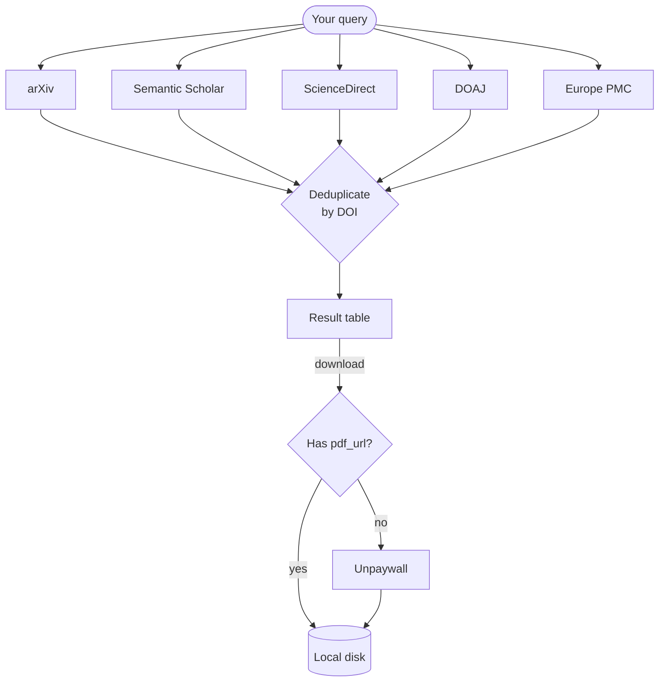

# Sources

MOSAIC aggregates results from five bibliographic databases plus one PDF resolver.



## arXiv

| Property | Value |
|----------|-------|
| Auth | None |
| Content | Preprints — physics, maths, CS, biology, economics |
| PDF | Always available (all arXiv papers are OA) |
| Rate limit | 3 s between requests, max 2 000/page, 30 000 total |
| Base URL | `https://export.arxiv.org/api/query` |

arXiv is the best source for recent preprints and CS/physics papers. Because everything on arXiv is open access, `--oa-only` has no effect on arXiv results.

**Search fields supported:** `all:`, `ti:` (title), `au:` (author), `abs:` (abstract), `cat:` (category), `jr:` (journal ref)

```bash
mosaic search "ti:attention au:vaswani" --source arxiv
```

## Semantic Scholar

| Property | Value |
|----------|-------|
| Auth | Optional API key |
| Content | 214 million papers across all disciplines |
| PDF | `openAccessPdf.url` when available |
| Rate limit | 1 000 req/s (shared, no key) · 1 req/s (dedicated, with key) |
| Base URL | `https://api.semanticscholar.org/graph/v1` |

Semantic Scholar is the broadest source. Its `openAccessPdf` field provides a direct PDF link whenever Semantic Scholar has indexed a legal copy. Set an API key in the config for a private rate-limit slot.

## ScienceDirect

| Property | Value |
|----------|-------|
| Auth | API key required |
| Content | Elsevier journals and books |
| PDF | Open-access articles only (by default) |
| Rate limit | 20 000–50 000 req/week, 2–10 req/s |
| Base URL | `https://api.elsevier.com/content/search/sciencedirect` |

::: warning API key required
ScienceDirect is disabled until you set an Elsevier API key:
```bash
mosaic config --elsevier-key YOUR_KEY
```
Register free at [dev.elsevier.com](https://dev.elsevier.com) (academic/non-commercial use).
:::

By default MOSAIC filters `openAccess: true` so only freely downloadable papers are returned. Full-text access to subscribed content additionally requires an institutional token or a campus/VPN IP.

## DOAJ

| Property | Value |
|----------|-------|
| Auth | None |
| Content | 100 % open-access journals (8 million+ articles) |
| PDF | Link included when published by a DOAJ-indexed journal |
| Rate limit | 2 req/s |
| Base URL | `https://doaj.org/api/v3/search/articles` |

Every result from DOAJ is fully open access by definition. Good source for humanities and social sciences in addition to STEM.

## Europe PMC

| Property | Value |
|----------|-------|
| Auth | None |
| Content | 45 million biomedical and life-science articles |
| PDF | PMC full-text PDF for open-access articles |
| Rate limit | No documented hard limit |
| Base URL | `https://www.ebi.ac.uk/europepmc/webservices/rest/search` |

Europe PMC is the best source for biomedical literature. Open-access papers with a PubMed Central ID (PMCID) include a direct PDF link.

## Unpaywall (PDF resolver)

Unpaywall is not a search source — it is a resolver used during download. For any paper with a DOI but no known PDF URL, MOSAIC calls:

```
GET https://api.unpaywall.org/v2/{doi}?email=you@example.com
```

Unpaywall checks 50 000+ repositories (PubMed Central, institutional repos, author pages, preprint servers) and returns the `best_oa_location.url_for_pdf` if a legal copy exists.

::: tip
Set your email in the config to enable this fallback:
```bash
mosaic config --unpaywall-email you@example.com
```
:::
