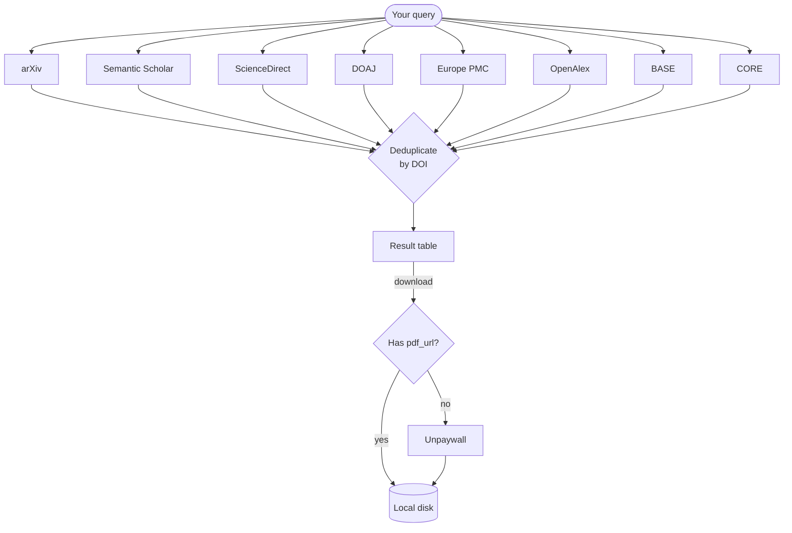

# Sources

MOSAIC aggregates results from five bibliographic databases plus one PDF resolver.



## arXiv

| Property | Value |
|----------|-------|
| Auth | None |
| Content | Preprints — physics, maths, CS, biology, economics |
| PDF | Always available (all arXiv papers are OA) |
| Rate limit | 3 s between requests, max 2 000/page, 30 000 total |
| Base URL | `https://export.arxiv.org/api/query` |

arXiv is the best source for recent preprints and CS/physics papers. Because everything on arXiv is open access, `--oa-only` has no effect on arXiv results.

**Search fields supported:** `all:`, `ti:` (title), `au:` (author), `abs:` (abstract), `cat:` (category), `jr:` (journal ref)

```bash
mosaic search "ti:attention au:vaswani" --source arxiv
```

## Semantic Scholar

| Property | Value |
|----------|-------|
| Auth | Optional API key |
| Content | 214 million papers across all disciplines |
| PDF | `openAccessPdf.url` when available |
| Rate limit | 1 000 req/s (shared, no key) · 1 req/s (dedicated, with key) |
| Base URL | `https://api.semanticscholar.org/graph/v1` |

Semantic Scholar is the broadest source. Its `openAccessPdf` field provides a direct PDF link whenever Semantic Scholar has indexed a legal copy. Set an API key in the config for a private rate-limit slot.

## ScienceDirect

| Property | Value |
|----------|-------|
| Auth | API key required |
| Content | Elsevier journals and books |
| PDF | Open-access articles only (by default) |
| Rate limit | 20 000–50 000 req/week, 2–10 req/s |
| Base URL | `https://api.elsevier.com/content/search/sciencedirect` |

::: warning API key required
ScienceDirect is disabled until you set an Elsevier API key:
```bash
mosaic config --elsevier-key YOUR_KEY
```
Register free at [dev.elsevier.com](https://dev.elsevier.com) (academic/non-commercial use).
:::

By default MOSAIC filters `openAccess: true` so only freely downloadable papers are returned. Full-text access to subscribed content additionally requires an institutional token or a campus/VPN IP.

## DOAJ

| Property | Value |
|----------|-------|
| Auth | None |
| Content | 100 % open-access journals (8 million+ articles) |
| PDF | Link included when published by a DOAJ-indexed journal |
| Rate limit | 2 req/s |
| Base URL | `https://doaj.org/api/v3/search/articles` |

Every result from DOAJ is fully open access by definition. Good source for humanities and social sciences in addition to STEM.

## Europe PMC

| Property | Value |
|----------|-------|
| Auth | None |
| Content | 45 million biomedical and life-science articles |
| PDF | PMC full-text PDF for open-access articles |
| Rate limit | No documented hard limit |
| Base URL | `https://www.ebi.ac.uk/europepmc/webservices/rest/search` |

Europe PMC is the best source for biomedical literature. Open-access papers with a PubMed Central ID (PMCID) include a direct PDF link.

## OpenAlex

| Property | Value |
|----------|-------|
| Auth | None (email optional) |
| Content | 250 million+ works across all disciplines |
| PDF | `best_oa_location.pdf_url` when available |
| Rate limit | 100 000 req/day (anonymous) · higher with polite-pool email |
| Base URL | `https://api.openalex.org/works` |

OpenAlex is the broadest freely available bibliographic database, covering journals, conference papers, books, datasets, and preprints across all disciplines. It is the successor to Microsoft Academic Graph.

When you set an Unpaywall email in the config, MOSAIC reuses it as the OpenAlex [polite-pool](https://docs.openalex.org/how-to-use-the-api/rate-limits-and-authentication) identifier, which grants significantly higher rate limits.

Abstracts in OpenAlex are stored as inverted indices (due to publisher licensing). MOSAIC reconstructs them automatically into plain text.

::: tip CLI shorthand
```bash
mosaic search "transformer" --source oa
```
:::

## BASE (Bielefeld Academic Search Engine)

| Property | Value |
|----------|-------|
| Auth | None |
| Content | 300 million+ documents from 10 000+ content providers |
| PDF | Direct PDF link when source format is `application/pdf` and OA |
| Rate limit | No documented hard limit — use responsibly |
| Base URL | `https://api.base-search.net/cgi-bin/BaseHttpSearchInterface.fcgi` |

BASE aggregates metadata from institutional repositories, open-access journals, and digital libraries worldwide. It is particularly strong for grey literature, theses, and documents not indexed by journal-centric databases.

Search queries support Lucene syntax. Filters for author (`dccreator`), journal (`dcsource`), and year (`dcyear`) are appended natively.

::: tip CLI shorthand
```bash
mosaic search "climate change" --source base
```
:::

## CORE

| Property | Value |
|----------|-------|
| Auth | API key required (free — register at [core.ac.uk/services/api](https://core.ac.uk/services/api)) |
| Content | 200 million+ OA full-text documents from 10 000+ repositories |
| PDF | `downloadUrl` field — CORE's recommended full-text link |
| Rate limit | Varies by tier; free academic key gives generous limits |
| Base URL | `https://api.core.ac.uk/v3/search/works` |

CORE aggregates open-access full text from institutional repositories, preprint servers, and OA journals worldwide. Unlike BASE, CORE focuses exclusively on OA content and always provides a `downloadUrl` pointing to the actual document — making it the most reliable source for direct PDF access.

Filters for author (`authors.name`), journal (`journals.title`), and year (`yearPublished`) are applied natively in the query.

::: warning API key required
CORE is disabled until you set an API key:
```bash
# Edit ~/.config/mosaic/config.toml
[sources.core]
api_key = "YOUR_FREE_KEY"
```
Register for a free key at [core.ac.uk/services/api](https://core.ac.uk/services/api).
:::

::: tip CLI shorthand
```bash
mosaic search "open access publishing" --source core
```
:::

## Unpaywall (PDF resolver)

Unpaywall is not a search source — it is a resolver used during download. For any paper with a DOI but no known PDF URL, MOSAIC calls:

```
GET https://api.unpaywall.org/v2/{doi}?email=you@example.com
```

Unpaywall checks 50 000+ repositories (PubMed Central, institutional repos, author pages, preprint servers) and returns the `best_oa_location.url_for_pdf` if a legal copy exists.

::: tip
Set your email in the config to enable this fallback:
```bash
mosaic config --unpaywall-email you@example.com
```
:::
