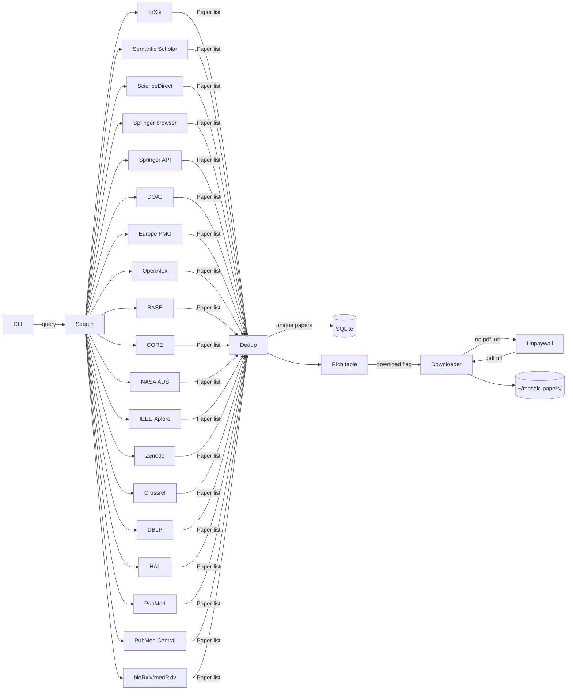

## Quick start

```bash
pipx install mosaic-search   # or: uv tool install mosaic-search
mosaic config --unpaywall-email you@example.com
mosaic search "attention is all you need" --oa-only --download
```

## AI features

### Local RAG — mosaic index / ask / chat

Index your cached papers once and interrogate your library in natural language. Four structured analysis modes produce cited, grounded answers:

| Mode | What it produces |
|------|-----------------|
| `synthesis` | Comprehensive state-of-the-art summary |
| `gaps` | Open problems, contradictions, methodological limitations |
| `compare` | Side-by-side comparison of methods, datasets, metrics, results |
| `extract` | Per-paper structured extraction: Task · Method · Dataset · Metric · Result |

```bash
pipx inject mosaic-search sqlite-vec          # install vector extension once

mosaic index                                  # embed all cached papers
mosaic ask "What are the main approaches to graph neural networks?" --show-sources
mosaic ask "What open problems remain in protein structure prediction?" --mode gaps
mosaic chat                                   # interactive multi-turn session
```

Runs entirely on your machine via [Ollama](https://ollama.com) or any OpenAI-compatible server. → [RAG guide](./guide/rag)

---

### Relevance ranking — `--sort relevance`

Re-rank any result set by semantic similarity to the query. BM25 by default (no model, no network, instant). Configure your LLM for higher-quality scores.

```bash
mosaic search "diffusion models" --sort relevance          # live, ranked
mosaic search "diffusion models" --cached --sort relevance # offline, from local cache
```

→ [Relevance ranking guide](./guide/relevance-ranking)

---

### NotebookLM — `mosaic notebook`

Turn any search into a Google NotebookLM notebook in one command. Podcast, video overview, slides, quiz, flashcards, mind map, briefing doc — all queued automatically.

```bash
mosaic notebook create "Transformers" --query "attention mechanism" --oa-only --podcast --briefing
```

→ [NotebookLM guide](./guide/notebooklm)

---

### Claude Code Skill & AI agent mode — `mosaic skill install`

MOSAIC ships a bundled [Claude Code](https://claude.ai/claude-code) skill. Install it once and the
`/mosaic` slash command gives Claude Code expert knowledge of every command, source shorthand,
filter, export format, and scripting pattern — so you can describe your bibliography goal in plain
English and let Claude Code build and run the right commands for you.

```bash
# Install into the current project's .claude/skills/ directory
mosaic skill install

# Or globally, for all your projects
mosaic skill install --global
```

All `search` and `similar` commands support `--json` for structured stdout — a clean
`{status, query, count, papers[], errors[]}` envelope designed for piping, agent scripts, and CI:

```bash
# Pipe directly to jq
mosaic search "attention mechanism" --max 30 --oa-only --json \
  | jq -r '.papers[] | "\(.year)  \(.doi)  \(.title)"'

# Combine file export and stdout JSON in one run
mosaic search "FDTD methods" --json --output refs.bib
```

→ [Agent Workflows guide](./guide/agent-workflows)

---

## Architecture



## Authors

**[Stefano Zaghi](https://github.com/szaghi)** · stefano.zaghi@gmail.com
> *Chief Yak Shaver & Accidental Package Maintainer* — Fortran programmer who needed one paper, opened 21 browser tabs, and six months later found himself maintaining a Python library

**[Andrea Giulianini](https://github.com/AndreaGiulianini)**
> *Grand Pixel Overlord & Architect of the Sacred Button* — world-class web UI designer, responsible for making MOSAIC actually look good

**[Claude](https://claude.ai)** (Anthropic)
> *Omniscient Code Oracle & Tireless Rubber Duck* — AI pair programmer, responsible for writing the boring parts so humans don't have to

Contributions are welcome.

## License

MOSAIC is available under your choice of license: GPL-3.0-or-later, BSD-2-Clause, BSD-3-Clause, or MIT.
See [LICENSE.gpl3.md](https://github.com/szaghi/mosaic/blob/main/licensing/LICENSE.gpl3.md), [LICENSE.bsd-2.md](https://github.com/szaghi/mosaic/blob/main/licensing/LICENSE.bsd-2.md), [LICENSE.bsd-3.md](https://github.com/szaghi/mosaic/blob/main/licensing/LICENSE.bsd-3.md), [LICENSE.mit.md](https://github.com/szaghi/mosaic/blob/main/licensing/LICENSE.mit.md).

© [Stefano Zaghi](https://github.com/szaghi)
