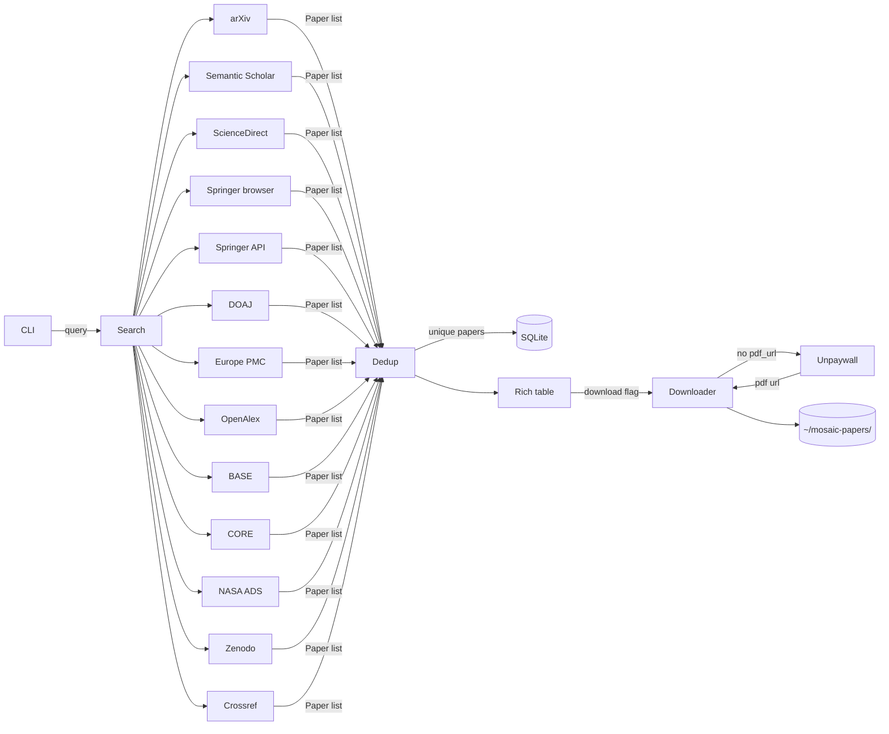

## Quick start

```bash
pipx install mosaic-search   # or: uv tool install mosaic-search
mosaic config --unpaywall-email you@example.com
mosaic search "attention is all you need" --oa-only --download
```

## Architecture



## Authors

- Stefano Zaghi — [@szaghi](https://github.com/szaghi)

Contributions are welcome.

## License

MOSAIC is available under your choice of license: GPL-3.0-or-later, BSD-2-Clause, BSD-3-Clause, or MIT.
See [LICENSE.gpl3.md](https://github.com/szaghi/mosaic/blob/main/LICENSE.gpl3.md), [LICENSE.bsd-2.md](https://github.com/szaghi/mosaic/blob/main/LICENSE.bsd-2.md), [LICENSE.bsd-3.md](https://github.com/szaghi/mosaic/blob/main/LICENSE.bsd-3.md), [LICENSE.mit.md](https://github.com/szaghi/mosaic/blob/main/LICENSE.mit.md).

© [Stefano Zaghi](https://github.com/szaghi)
